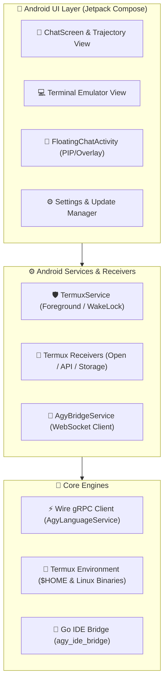

# <div align="center">⚡ AntiGem</div>

<div align="center">
  <strong>The Next-Generation Agentic AI Coding Companion, Native Termux Terminal & Language Server Hub for Android</strong>
</div>

<br/>

<div align="center">

[](https://kotlinlang.org)
[](https://developer.android.com/jetpack/compose)
[](https://square.github.io/wire/)
[](https://golang.org)
[](https://termux.dev)

</div>

---

## 🌟 Overview

**AntiGem** is a powerhouse Android application that turns your mobile device into a first-class AI development workspace. Combining a high-performance **Jetpack Compose** interface, a native **Termux Linux subsystem**, an **agentic AI assistant** connected directly to the Antigravity (AGY) daemon over type-safe Square Wire gRPC, and an embedded **Go IDE bridge**, AntiGem bridges full-stack terminal productivity with next-gen agentic pair programming.

---

## 📸 App Showcase

<div align="center">
  <table>
    <tr>
      <td align="center" width="33%">
        
        <br /><strong>💬 Agentic Chat & Tool Execution</strong>
      </td>
      <td align="center" width="33%">
        
        <br /><strong>💻 Full IDE Code Editor</strong>
      </td>
      <td align="center" width="33%">
        
        <br /><strong>🐧 Native Termux Terminal</strong>
      </td>
    </tr>
    <tr>
      <td align="center" width="33%">
        
        <br /><strong>📂 Sidebar & History</strong>
      </td>
      <td align="center" width="33%">
        
        <br /><strong>⚡ Quota & Account Info</strong>
      </td>
      <td align="center" width="33%">
        
        <br /><strong>⚙️ Settings, MCP & Backups</strong>
      </td>
    </tr>
    <tr>
      <td align="center" colspan="3">
        
        <br /><strong>🌐 Integrated Web Browser & Automation</strong>
      </td>
    </tr>
  </table>
</div>

---

## ✨ Key Features

### 🤖 1. Autonomous Agentic AI & Language Server Daemon
- **Direct Wire gRPC Service**: Type-safe, high-speed communication with the local or remote Antigravity (AGY) daemon using Square Wire (`AgyLanguageService`).
- **Reactive Streaming**: Real-time token and step streaming directly into Compose UI via Kotlin Coroutines & `Flow`.
- **Automatic CSRF Recovery**: Zero-friction re-authentication interceptor on `401`, `403`, or `grpc-status: 16`.
- **Model Switcher & Quota Tracking**: Instant switching between Gemini 3.7 Flash, Pro, Ultra, Claude 3.5 Sonnet, GPT-4o, and custom models with real-time prompt/flow quota indicators.
- **Trajectory & Step Inspector**: Live agent thought process visualization, collapsible reasoning logs, tool call execution status, and subagent monitoring.

### 🌐 2. Integrated Web Browser & Browser Automation MCP
- **Built-in Web Browser**: Full-featured in-app browser with tab management, URL navigation, search shortcuts, and dev controls.
- **Autonomous Browser Automation MCP**: Empowers the AI agent to navigate live web pages, interact with DOM elements, click buttons, fill forms, execute scripts, and inspect web app interfaces.
- **Visual UI Verification**: Captures screenshots of locally running or external web applications directly into the agent's context for visual UI analysis, frontend debugging, and pair programming.

### 💻 3. Linux Terminal & Terminal Automation MCP
- **Native Terminal Emulator**: High-throughput PTY terminal engine (`LocalTerminalManager`) with custom font scaling, palette themes, and interactive keybars.
- **Complete Linux Environment**: Pre-configured GNU bash, zsh, coreutils, Python, Node.js, Git, Go, and Glibc toolchains in `$HOME`.
- **Live Terminal Automation MCP**: Allows the AI agent to execute shell commands, run tests, compile code, and stream live stdout/stderr directly in front of the user with real-time feedback.
- **Background Execution Service**: Keeps server daemons, builds, and AI background processes running seamlessly in foreground execution.

### 📝 4. Full IDE Code Editor & Multi-Tab Workspace
- **Multi-Language Syntax Highlighting**: Fast, responsive code editor supporting Python, Go, Kotlin, Java, JS/TS, Shell, Rust, C/C++, HTML/CSS, JSON, YAML, and Markdown.
- **IDE Productivity Controls**: Tab switching, find/replace, undo/redo, line numbering, auto-indentation, and one-tap script execution.
- **Workspace Navigation**: Instant directory tree explorer, recent file switcher, and project switching.

### 🎨 5. Rich Chat Artifacts & Mermaid Diagrams
- **Interactive Chat Artifacts**: Dynamic markdown rendering supporting live code viewers, expandable diff blocks, step carousels, and alerts.
- **Hardware-Accelerated Mermaid Diagrams**: Native rendering for architecture flows, sequence diagrams, state machines, and class hierarchies.
- **Floating Chat Bubble (PIP/Overlay)**: Overlay Picture-in-Picture window (`FloatingChatActivity`) to prompt and code while multitasking across any Android app.

### 🧩 6. MCP Ecosystem, Skills & Google Plugins
- **Dynamic MCP Config**: Easily manage, enable, disable, and configure Model Context Protocol (MCP) servers (`mcp_config.json`).
- **Google Cascade Plugins**: In-app plugin catalog to search, install, and manage specialized assistant plugins.
- **Custom Skills Hub**: Support for both workspace-level (`.agents/skills`) and global (`~/.gemini/config/skills`) on-demand workflow cheat-sheets.

### 🛡️ 7. Full Rootfs & Chat Backup Suite
- **Rootfs Environment Backup**: Package your entire installed Linux packages, libraries, binaries, shell configs, and dotfiles into `/sdcard/Download/Antigem/backups/`.
- **AGY Chats & Auth Backup**: Package conversation history databases, brain transcripts, indexes, and credentials with optional zip encryption.
- **Safe Timestamped Restore**: Automatic safety backup (`~/.gemini.bak.<timestamp>`) and pre-extraction password validation to prevent data loss.

### 🔄 8. Seamless In-App Auto-Updater
- Centralized multi-flavor version checking via `version.json`.
- Live chunked download progress with background resume support.
- Native Android `PackageInstaller` session integration for one-tap in-app upgrades.

---

## 🏗️ Architecture



---

## 📦 Flavor Variants

AntiGem is packaged in two build flavors to match your deployment requirements:

| Flavor | Package ID (`applicationId`) | Description |
| :--- | :--- | :--- |
| **`standard`** | `com.antigem` | Standard standalone release for regular Android environments. |
| **`termux`** | `com.termux` | Specialized release designed for direct Termux replacement and shared namespace workflows. |

---

## 🛠️ Building From Source

### Prerequisites
- **JDK 17** or higher
- **Android SDK** (API Level 35, Build Tools 35.0.0+)
- **Go 1.23+** (for compiling `agy_ide_bridge`)
- **Gradle 8.11+**

### 1. Clone the Repository
```bash
git clone https://github.com/santoshkurmi/antigem.git
cd antigem
```

### 2. Build Go IDE Bridge & Android APKs
You can build individual flavors or use the automated unified build script:

```bash
# Build All Flavors (Debug & Release)
./scripts/build_all_apks.sh

# Build Specific Flavor via Gradle
./gradlew assembleStandardRelease
./gradlew assembleTermuxRelease
```

Compiled APKs will be output to:
- `build/outputs/apk_all/`
- `app/build/outputs/apk/<flavor>/<buildType>/`

---

## 📂 Project Structure

```text
antiGem/
├── app/
│   ├── src/main/
│   │   ├── java/com/example/gemini/
│   │   │   ├── data/
│   │   │   │   ├── local/        # Terminal, Storage, and Environment Managers
│   │   │   │   ├── receiver/     # Termux Intent & API Broadcast Receivers
│   │   │   │   ├── remote/       # Wire gRPC Service & WebSocket Clients
│   │   │   │   ├── service/      # TermuxService (Foreground execution)
│   │   │   │   └── updater/      # In-App Auto-Updater
│   │   │   ├── ui/               # Jetpack Compose Screens, Dialogs & Floating Chat
│   │   │   └── theme/            # Design System & Theme Engine
│   │   └── res/                  # Android XML Resources, Vectors & FileProvider paths
├── proto_generator/              # Square Wire Protobuf definitions & generators
├── scripts/                      # Automated build and packaging scripts
└── version.json                  # Centralized version metadata & release manifest
```

---

## 🤝 Contributing

Contributions are welcome! If you'd like to report bugs, suggest features, or submit pull requests:
1. Fork the repository
2. Create your feature branch (`git checkout -b feature/amazing-feature`)
3. Commit your changes (`git commit -m 'feat: Add amazing feature'`)
4. Push to the branch (`git push origin feature/amazing-feature`)
5. Open a Pull Request

---

## 📄 License

AntiGem is open-source software licensed under the **Apache License 2.0**(Not sure if adding in readme is enough to say this).
