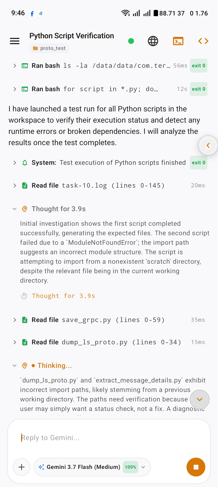
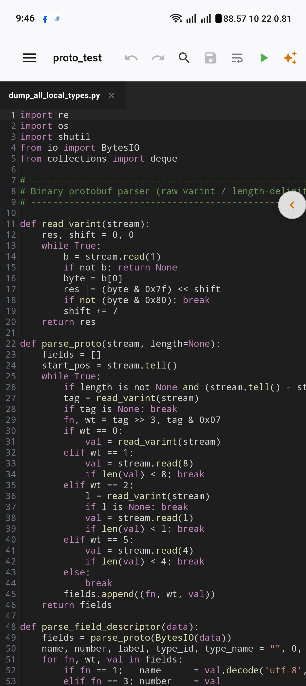
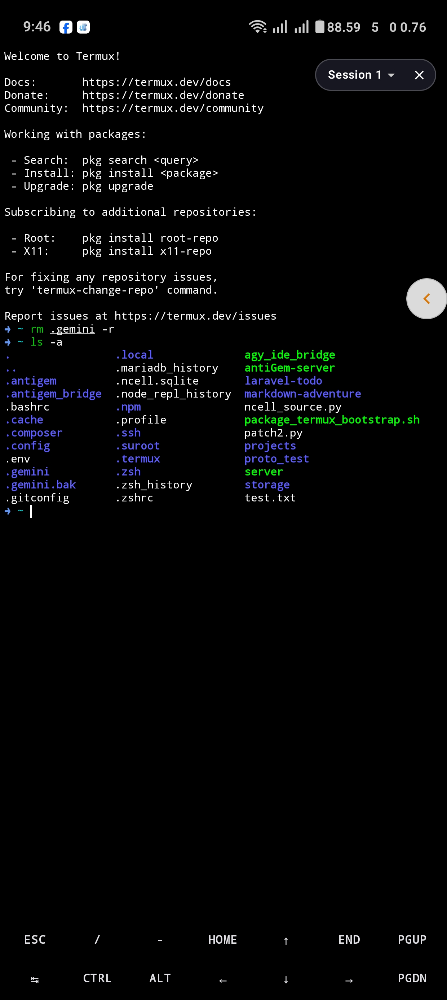
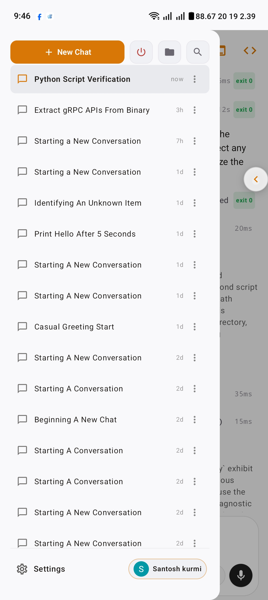
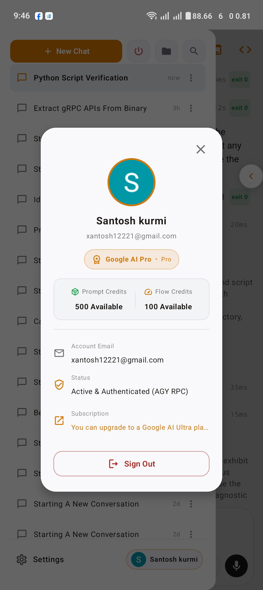
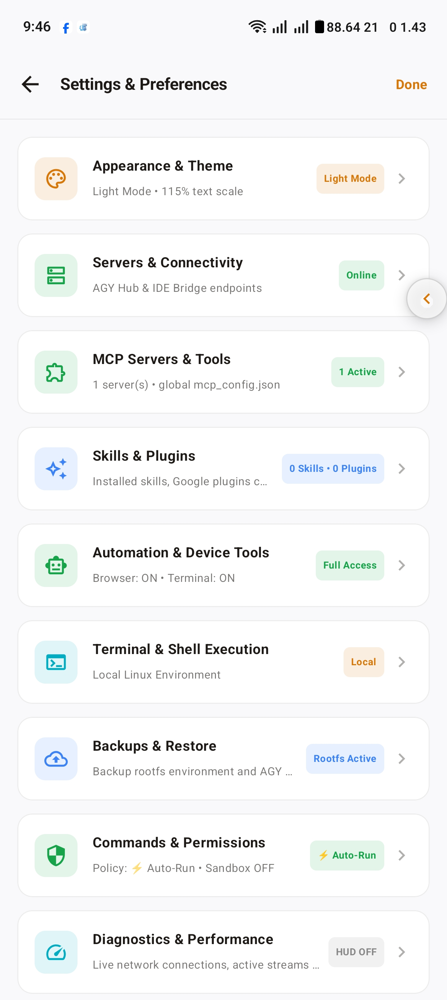
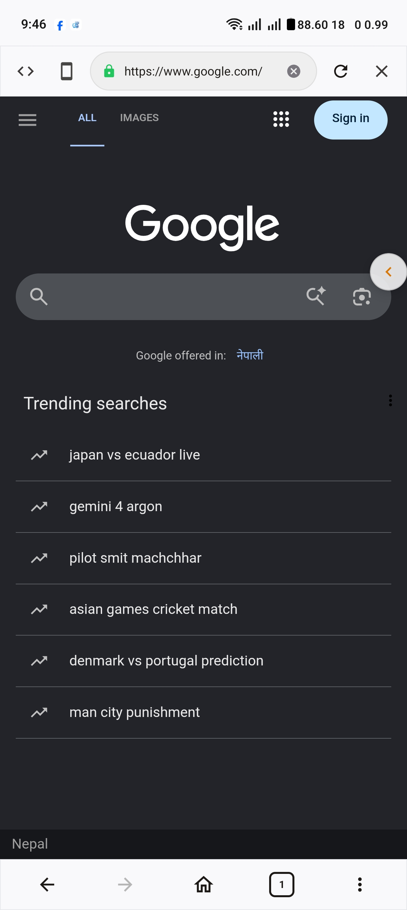

# <div align="center">⚡ AntiGem</div>

<div align="center">
  <strong>The Next-Generation Agentic AI Coding Workspace, Native Termux Terminal & Language Server Hub for Android</strong>
</div>

<br/>

<div align="center">

[](https://kotlinlang.org)
[](https://developer.android.com/jetpack/compose)
[](https://square.github.io/wire/)
[](https://golang.org)
[](https://termux.dev)

</div>

---

## 🌟 Overview

**AntiGem** turns your Android device into a complete agentic AI development environment. It pairs a modern **Jetpack Compose** UI with a native **Termux Linux subsystem**, an **embedded Go IDE bridge**, and two coding agents:

- **Antigravity (`agy`)** — through a direct **binary gRPC connection** to the `agy` language server daemon.
- **Claude Code** — Anthropic's official `claude` CLI, running inside the app's Linux environment.

Pick one or both on first launch, and switch any time in **Settings → Agents**. An agent you turn off does not run at all.

Unlike traditional AI wrappers that scrape CLI output, AntiGem talks to each agent through its structured protocol: the `agy` binary over **gRPC hub mode**, and Claude Code over its **stream-json** protocol (one long-lived CLI process per chat). This unlocks fully interactive bi-directional capabilities — including real-time token streaming, multi-step subagent execution, live question-and-answer prompts, tool confirmations, and instant file synchronization.

---

## 📦 App Variants: Which one should you download?

AntiGem comes in two build variants:

| Variant | Package ID (`applicationId`) | Recommended? | How it works |
| :--- | :--- | :---: | :--- |
| **`termux`** | `com.termux` | **✅ Yes (Recommended)** | **All-in-one standalone environment.** You do **not** need Termux installed. The app natively runs its own full Linux environment, package manager (`apt`/`pkg`), shell, and binaries inside its own private sandbox. |
| **`standard`** | `com.antigem` | Optional | Requires the standalone **Termux** app installed on your phone. You run `agy_ide_bridge` inside Termux and connect the AntiGem app to it over localhost. *(Note: PRoot is not used for now).* |

> [!TIP]
> **Download Note:** For the latest releases, we primarily build and publish the **`termux`** flavor (`antiGem-termux-v*-release.apk`). If you specifically prefer the `standard` variant, you can find older releases or easily fork the repository and build your own APK using Gradle or GitHub Actions.

---

## 🏗️ How It Works

```
┌─────────────────────────────────────────────────────────────┐
│                 📱 AntiGem Android App                      │
│            (Jetpack Compose UI & Native Terminal)           │
└───────────────────────────┬─────────────────────────────────┘
                            │
              Binary Protobuf / gRPC & WebSockets
                            │
┌───────────────────────────▼─────────────────────────────────┐
│               🐹 Embedded Go IDE Bridge                     │
│                   (agy_ide_bridge)                          │
└──────────────┬───────────────────────────────┬──────────────┘
               │                               │
    Direct gRPC Hub Protocol        stream-json (NDJSON relay)
               │                               │
┌──────────────▼──────────────┐ ┌──────────────▼──────────────┐
│  ⚡ Antigravity (agy) Core  │ │  ✻ Claude Code CLI          │
│  (Language Server Daemon,   │ │  (one process per chat,     │
│   Models & MCP Agents)      │ │   models, tools & MCP)      │
└─────────────────────────────┘ └─────────────────────────────┘
```

- **Type-Safe gRPC Protocol**: Directly speaks the protobuf schema of `agy` over Square Wire instead of scraping command-line text.
- **Native Claude Code Protocol**: The bridge runs the official `claude` CLI in stream-json mode and relays it to the app over WebSockets, so models, effort, thinking and permission mode switch live without restarting the chat.
- **Deep Agent Interactivity**: Supports complex agent workflows, interactive multiple-choice questions, and permission confirmations natively within the chat UI.
- **Native Android PTY Engine**: Runs a complete PTY terminal alongside background execution services for long-running compiles, servers, and scripts.

---

## 📸 App Showcase

<div align="center">

### 💬 Agentic Chat & Tool Execution


---

### 💻 Full IDE Code Editor


---

### 🐧 Native Linux Terminal


---

### 📂 Sidebar & Workspace History


---

### ⚡ Quota & Account Info


---

### ⚙️ Settings, MCP & Backups


---

### 🌐 Integrated Web Browser & Automation


</div>

---

## ✨ Key Features

### 🤖 1. Autonomous Agentic AI
- **Direct Wire gRPC Hub**: Type-safe, low-latency communication with `agy` using Square Wire.
- **Live Streamed Reasoning**: Real-time token streaming, thought collapse/expansion, tool execution cards, and subagent tracking.
- **Model Switching & Quota**: Switch between Gemini 3.7 Flash, Pro, Ultra, Claude 3.5 Sonnet, GPT-4o, and custom models with real-time prompt quota indicators.
- **Interactive Prompts**: Supports interactive confirmation modals and multiple-choice questions generated by the AI agent.

### ✻ 2. Claude Code Agent
- **Official Claude Code**: Runs Anthropic's `claude` CLI inside the app — install or update it and sign in with your Claude subscription or Anthropic Console account from **Settings → Claude Code**.
- **Full Chat Experience**: Live streaming with thinking summaries, tool cards with approvals (allow once / always), plan approval, Claude's questions, subagents, images and file attachments, and voice dictation.
- **Live Chat Controls**: Switch model, effort level, thinking and permission mode (Manual, Accept edits, Plan, Auto, Don't ask) mid-chat; the app checks every change against what the CLI really runs.
- **Usage at a Glance**: Prompt-cache timer, context window usage, 5-hour and weekly plan limits, and per-reply token counts with the model that answered.
- **Chat Management**: Slash commands (including `/compact`), edit or regenerate a message in place, fork, rename and delete chats — all saved in Claude Code's own history.
- **Settings**: Chat defaults, permission rules and command sandbox, MCP servers (including the in-app browser & terminal automation server), plugins and marketplaces, `CLAUDE.md` instructions and Claude's saved memory.

### 💻 3. Native Linux Terminal Subsystem
- **High-Performance PTY**: Fast terminal emulator with customizable font sizes, themes, and interactive quick-keys.
- **Complete Linux Ecosystem**: Pre-configured bash, coreutils, Python, Node.js, Git, Go, and Glibc toolchains in `$HOME`.
- **Live Terminal MCP**: Lets AI agents run commands, run tests, build projects, and stream output with continuous foreground execution.

### 📝 4. Mobile IDE Code Editor
- **Syntax Highlighting**: Fast editor supporting Python, Go, Kotlin, Java, JS/TS, Rust, C/C++, HTML/CSS, JSON, YAML, and Markdown.
- **Productivity Controls**: Multi-tab switcher, line numbering, find/replace, undo/redo, auto-indentation, and file explorer.

### 🌐 5. Integrated Web Browser & Automation MCP
- **Built-in Browser**: In-app web browser for previewing local dev servers and testing web applications.
- **Browser Automation**: Allows the AI agent to inspect live web pages, interact with DOM elements, test UI workflows, and verify frontend components.

### 🎨 6. Dynamic Chat Artifacts & Diagrams
- **Interactive Markdown & Diffs**: Expandable diff blocks, step carousels, and copyable code blocks.
- **Mermaid Diagrams**: Native hardware-accelerated rendering for flowcharts, architecture diagrams, and state machines.
- **Floating Chat (PIP)**: Multi-task across Android with the floating picture-in-picture overlay.

### 🛡️ 7. Full Backup Suite & In-App Updates
- **Rootfs Backup**: One-tap backup of your entire installed Linux rootfs, dotfiles, and binaries to phone storage.
- **Chat & Auth Backup**: Export your conversation databases, brain transcripts, and credentials.
- **One-Tap Updater**: In-app version checks and direct APK updates.

---

## 🛠️ Building From Source

### Prerequisites
- **JDK 17+**
- **Android SDK** (API Level 35, Build Tools 35.0.0+)
- **Go 1.23+** (for compiling `agy_ide_bridge`)
- **Gradle 8.11+**

### Build Commands
```bash
# Clone the repository
git clone https://github.com/santoshkurmi/antigem.git
cd antigem

# Build both flavors (Debug & Release)
./scripts/build_all_apks.sh

# Or build the recommended Termux flavor directly via Gradle:
./gradlew assembleTermuxDebug
./gradlew assembleTermuxRelease
```

Compiled APKs are saved to:
- `build/outputs/apk_all/`
- `app/build/outputs/apk/<flavor>/<buildType>/`

---

## 📂 Project Structure

```text
antiGem/
├── app/
│   ├── src/main/
│   │   ├── java/com/example/gemini/
│   │   │   ├── data/
│   │   │   │   ├── agent/        # Agent backends: Antigravity (agy/) and Claude Code (claude/)
│   │   │   │   ├── local/        # Terminal, Storage, and Environment Managers
│   │   │   │   ├── receiver/     # Termux Intent & API Broadcast Receivers
│   │   │   │   ├── remote/       # Wire gRPC Service & WebSocket Clients
│   │   │   │   ├── service/      # TermuxService (Foreground execution)
│   │   │   │   └── updater/      # In-App Auto-Updater
│   │   │   ├── ui/               # Jetpack Compose Screens, Dialogs & Floating Chat
│   │   │   └── theme/            # Design System & Theme Engine
│   │   └── res/                  # Android XML Resources & FileProvider paths
├── agy_ide_bridge/               # Embedded Go bridge between Android, the AGY daemon and Claude Code
├── proto_generator/              # Square Wire Protobuf definitions & generators
├── scripts/                      # Automated build and backup scripts
└── version.json                  # Centralized version metadata & release manifest
```

---

## 🤝 Contributing

Contributions, feature suggestions, and pull requests are welcome!
1. Fork the repository
2. Create your branch (`git checkout -b feature/amazing-feature`)
3. Commit your changes (`git commit -m 'feat: Add amazing feature'`)
4. Push to the branch (`git push origin feature/amazing-feature`)
5. Open a Pull Request

---

## 📄 License

AntiGem is open-source software licensed under the **Apache License 2.0**.
