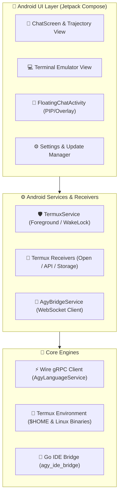

# <div align="center">⚡ AntiGem</div>

<div align="center">
  <strong>The Next-Generation Agentic AI Coding Companion, Native Termux Terminal & Language Server Hub for Android</strong>
</div>

<br/>

<div align="center">

[](https://kotlinlang.org)
[](https://developer.android.com/jetpack/compose)
[](https://square.github.io/wire/)
[](https://golang.org)
[](https://termux.dev)

</div>

---

## 🌟 Overview

**AntiGem** is a powerhouse Android application that turns your mobile device into a first-class AI development workspace. Combining a high-performance **Jetpack Compose** interface, a native **Termux Linux subsystem**, an **agentic AI assistant** connected directly to the Antigravity (AGY) daemon over type-safe Square Wire gRPC, and an embedded **Go IDE bridge**, AntiGem bridges full-stack terminal productivity with next-gen agentic pair programming.

---

## ✨ Key Features

### 🤖 1. Autonomous Agentic AI & Language Server Daemon
- **Direct Wire gRPC Service**: Type-safe, high-speed communication with the local or remote Antigravity (AGY) daemon using Square Wire (`AgyLanguageService`).
- **Reactive Streaming**: Live token and step streaming directly into Compose UI via Kotlin Coroutines & `Flow`.
- **Automatic CSRF Recovery**: Zero-friction re-authentication interceptor on `401`, `403`, or `grpc-status: 16`.
- **Tool Execution Engine**: Real-time tool invocation inspection, diff previews, terminal action confirmations, and multi-turn planning.

### 💻 2. Full-Fledged Termux Subsystem & Terminal
- **Native Terminal Emulator**: High-throughput terminal engine (`LocalTerminalManager`) with custom font engines, palette support, and swipe actions.
- **Complete Linux Environment**: Pre-configured with GNU bash, zsh, coreutils, Python, Node.js, Git, Go, and Glibc toolchains in `$HOME`.
- **Background Execution Service**: `TermuxService` keeps server daemons, builds, and AI background processes running seamlessly in foreground execution.

### ⚡ 3. Native Termux CLI & Intent Interoperability
Full compatibility with standard Termux CLI commands and broadcasts:
- 📁 **`termux-setup-storage`**: One-click storage permission management and symlink generation (`~/storage/shared`, `downloads`, `dcim`, `pictures`, `music`, `movies`, `documents`, `external-*`).
- 🌐 **`termux-open` / `termux-open-url` / `xdg-open`**: View or share local files via secure `FileProvider` with automatic MIME-type detection and chooser flags.
- 🔒 **`termux-wake-lock` / `termux-wake-unlock`**: High-performance Wi-Fi and partial wake locks with automatic **1-hour safety timeout protection**.
- 🛠️ **Termux:API Subsystem**: Comprehensive support for `termux-toast`, `termux-vibrate`, `termux-clipboard-*`, `termux-notification`, `termux-battery-status`, `termux-tts-speak`, `termux-torch`, and `termux-volume`.

### 🎨 4. Modern UI, Floating Bubbles & Dark Aesthetics
- **Floating Chat Bubble**: Overlay Picture-in-Picture window (`FloatingChatActivity`) to code, prompt, and interact with the AI assistant while multitasking in other apps.
- **Rich Markdown & Syntax Highlighting**: Custom tokenizers rendering code blocks, tables, inline diffs, alerts, and mermaid diagrams.
- **Adaptive Dynamic Dark Theme**: Tailored OLED-friendly aesthetic with glassmorphism, micro-animations, and fluid transitions.

### 🔄 5. Seamless In-App Auto-Updater
- Centralized multi-flavor version checking via `version.json`.
- Live chunked download progress with background resume support.
- Native Android `PackageInstaller` session integration for one-tap in-app upgrades.

---

## 🏗️ Architecture



---

## 📦 Flavor Variants

AntiGem is packaged in two build flavors to match your deployment requirements:

| Flavor | Package ID (`applicationId`) | Description |
| :--- | :--- | :--- |
| **`standard`** | `com.antigem` | Standard standalone release for regular Android environments. |
| **`termux`** | `com.termux` | Specialized release designed for direct Termux replacement and shared namespace workflows. |

---

## 🛠️ Building From Source

### Prerequisites
- **JDK 17** or higher
- **Android SDK** (API Level 35, Build Tools 35.0.0+)
- **Go 1.23+** (for compiling `agy_ide_bridge`)
- **Gradle 8.11+**

### 1. Clone the Repository
```bash
git clone https://github.com/santoshkurmi/antigem.git
cd antigem
```

### 2. Build Go IDE Bridge & Android APKs
You can build individual flavors or use the automated unified build script:

```bash
# Build All Flavors (Debug & Release)
./scripts/build_all_apks.sh

# Build Specific Flavor via Gradle
./gradlew assembleStandardRelease
./gradlew assembleTermuxRelease
```

Compiled APKs will be output to:
- `build/outputs/apk_all/`
- `app/build/outputs/apk/<flavor>/<buildType>/`

---

## 📖 CLI Intent Reference

AntiGem natively handles the following CLI invocations executed inside the terminal or external scripts:

| Command / Action | Description | Underlying Mechanism |
| :--- | :--- | :--- |
| `termux-setup-storage` | Grants storage permissions and sets up `~/storage` symlinks | Broadcast to `TermuxSystemReceiver` |
| `termux-open <file>` | Opens a local file or URL in the default Android handler | `TermuxOpenReceiver` via `FileProvider` |
| `termux-open-url <url>` | Opens an HTTP/HTTPS or deep-link URI in browser/app | Activity launch via `TermuxOpenActivity` |
| `termux-wake-lock` | Acquires Wi-Fi & CPU wake lock (Max 1h safety timeout) | Foreground service start on `TermuxService` |
| `termux-wake-unlock` | Releases held wake locks | Intent trigger on `TermuxService` |
| `termux-toast "<msg>"` | Displays native Android toast message | `TermuxApiReceiver` |
| `termux-clipboard-set` | Sets system clipboard content | `TermuxApiReceiver` |
| `termux-vibrate` | Triggers device haptic feedback | `TermuxApiReceiver` |

---

## 📂 Project Structure

```text
antiGem/
├── app/
│   ├── src/main/
│   │   ├── java/com/example/gemini/
│   │   │   ├── data/
│   │   │   │   ├── local/        # Terminal, Storage, and Environment Managers
│   │   │   │   ├── receiver/     # Termux Intent & API Broadcast Receivers
│   │   │   │   ├── remote/       # Wire gRPC Service & WebSocket Clients
│   │   │   │   ├── service/      # TermuxService (Foreground execution)
│   │   │   │   └── updater/      # In-App Auto-Updater
│   │   │   ├── ui/               # Jetpack Compose Screens, Dialogs & Floating Chat
│   │   │   └── theme/            # Design System & Theme Engine
│   │   └── res/                  # Android XML Resources, Vectors & FileProvider paths
├── proto_generator/              # Square Wire Protobuf definitions & generators
├── scripts/                      # Automated build and packaging scripts
└── version.json                  # Centralized version metadata & release manifest
```

---

## 🤝 Contributing

Contributions are welcome! If you'd like to report bugs, suggest features, or submit pull requests:
1. Fork the repository
2. Create your feature branch (`git checkout -b feature/amazing-feature`)
3. Commit your changes (`git commit -m 'feat: Add amazing feature'`)
4. Push to the branch (`git push origin feature/amazing-feature`)
5. Open a Pull Request

---

## 📄 License

AntiGem is open-source software licensed under the **Apache License 2.0**.
